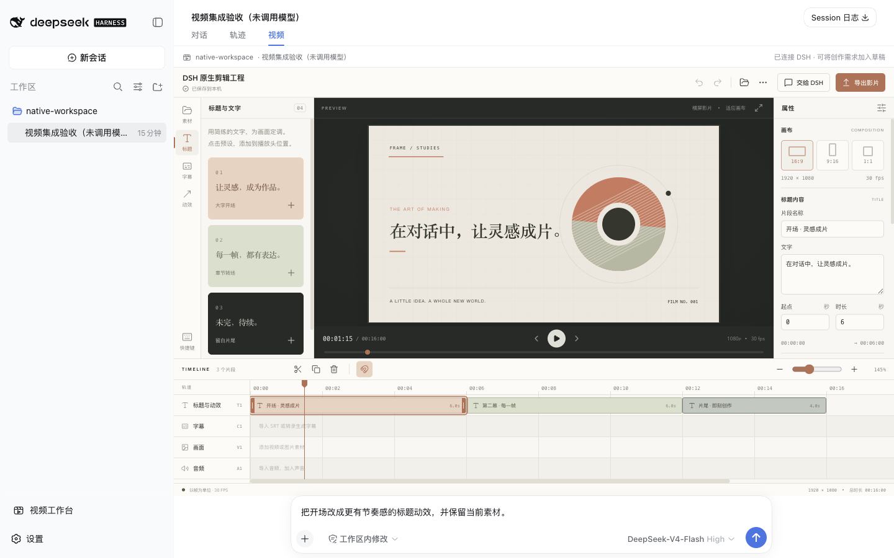

# DSH Video Studio

集成在 DeepSeek Harness 会话中的视频剪辑视图。工作区、会话和输入框与时间线协同使用。Remotion 负责预览与 MP4 导出，GSAP 动效由同一视频帧驱动。

[English](README.md)

## 安装与启动

需要 Node.js 22.12+，以及 DSH 使用的 pnpm。

```sh
npx @deepseek-ai/dsh plugin --profile web add -w github:lovstudio/dsh-video-studio
npx @deepseek-ai/dsh web
```

若 DSH 已在运行，安装后重启。选择工作区，在已有会话顶部打开 **视频** 标签。新会话可在输入框上方点击 **直接开始剪辑**，无需配置模型或先发送消息。侧边栏入口提供工作区引导。GitHub 仓库包含全部运行产物，无需手动构建。

如需固定版本，使用 `github:lovstudio/dsh-video-studio#v0.2.1`。



图中展示示例工程的编辑效果；新会话默认使用空白时间线，示例需手动打开。

## 工作台

素材库、实时画布、属性面板和四类轨道集中在一个界面：画面、音频、标题、字幕。支持导入媒体、排列和修剪片段、播放头分割、文字编辑、音量与构图调整、撤销重做，以及横版、竖版、方形画布。首次打开会优先恢复当前会话已保存的工程；没有工程时使用空白时间线。动态标题示例可通过“打开示例工程”手动创建。旧版已生成的示例和已有修改均会保留。

工程 JSON 与素材保存在宿主本机，服务端使用原子写入。JSON 备份包含素材引用，不内嵌素材文件。导出任务固定提交时的工程快照，显示进度，支持取消并下载 MP4。SRT 字幕导入导出无需配置 ASR。

点击 **交给 DSH** 会先保存工程，再将工程 ID、选中片段和播放位置加入当前会话草稿；保留原有输入，由你确认发送。DSH Agent 可通过已注册的工具读取、修改同一工程，保存结果自动同步到时间线。双方同时修改时显示版本冲突，可备份本地修改并载入最新版本。

在 DSH 内新建的工程归属当前工作区。既有未关联工程由用户点击“交给 DSH”时关联。模型工具按执行会话的实际工作区路径限制访问，不能认领未关联工程或读取其他工作区的工程。iframe 仅隔离 Remotion/React 运行时，导航、会话状态、输入、工具和鉴权均由 DSH 管理。

## 本地开发

需要 Node.js 22.12+、pnpm 11。依赖构建许可由本包 `pnpm-workspace.yaml` 管理。

```sh
pnpm install
pnpm typecheck
pnpm test
pnpm build
pnpm test:render # 真实 Chrome 渲染与帧确定性验证
pnpm dev
```

`http://127.0.0.1:4318/video-studio/` 是独立编辑器调试页，不包含 DSH 会话和 Agent 集成；插件验收请从 `dsh web` 进入。修改源码后需重新构建。开发服务器仅监听 loopback，并拒绝外部 Origin。

构建后，将本地工作目录安装到 DSH web profile 进行开发验证：

```sh
npx @deepseek-ai/dsh plugin --profile web add -w /absolute/path/to/dsh-video-studio
```

修改源码后应同时提交生成的 `lib/`。`pnpm verify:dist` 检查运行入口，CI 会重新构建并比对提交产物，防止用户安装到过期代码。Git 安装直接使用这些产物，无需 `prepare` 脚本。

## 服务 API、配置与扩展点

所有 HTTP 路由位于 `/video-studio/`。DSH host 在返回静态文件或调用 API 前均执行 connection 的 `requestRejection()`。浏览器不保存 ASR 密钥，媒体读取支持 Range 与 HEAD。

| 路由                       | 功能                               |
| -------------------------- | ---------------------------------- |
| `GET api/capabilities`     | 查询真实的 ASR 与渲染可用状态      |
| `GET api/projects`         | 读取已保存工程                     |
| `GET api/projects/:id`     | 读取最新工程与版本                 |
| `PUT api/projects/:id`     | 校验并原子保存工程                 |
| `POST api/assets`          | 流式上传素材                       |
| `GET media/:id`            | 受鉴权保护的素材读取与字节范围请求 |
| `POST api/render`          | 提交固定工程快照，生成 MP4         |
| `POST api/asr`             | 提交指定已上传素材的转录任务       |
| `GET api/jobs/:id`         | 读取任务状态与进度                 |
| `POST api/jobs/:id/cancel` | 取消排队或运行中的任务             |
| `GET exports/:id.mp4`      | 下载已完成的成片                   |

素材上传 body 为原始二进制，query 包含 `name`、`kind`、`duration` 和可选 `width`、`height`。工程使用带版本号的帧时间数据；渲染仅接受本机素材仓库中的引用。每个渲染任务使用临时 loopback 媒体服务器，仅暴露该快照允许访问的素材，不向 Chromium 传递用户的 DSH 登录 cookie。

ASR 必须在服务端显式配置，并选择能返回时间戳的服务与模型：

```sh
export DSH_VIDEO_ASR_ENDPOINT='https://your-provider.example/v1/audio/transcriptions'
export DSH_VIDEO_ASR_MODEL='your-timestamp-capable-model'
export DSH_VIDEO_ASR_FORMAT='diarized_json' # 或 verbose_json
# 通过已有的密钥管理方式设置 DSH_VIDEO_ASR_API_KEY。
```

示例域名是占位符，应替换为供应商文档中的实际地址。启动 ASR 会将选中素材发送给该配置服务。未完成配置时界面明确显示不可用，不伪造转录结果。ASR provider 注册返回 disposer，本地识别器或其他云服务可实现同一时间戳片段契约。渲染和 ASR 支持中止信号，随插件卸载清理。扩展插件声明注入 `videoStudioAsr`，在 `ctx.effect` 中调用 `ctx.get('videoStudioAsr').register(provider)`，并用 `asrProvider` 选择该 ID。provider 的 `transcribe({asset, language, signal})` 返回以秒为单位的 `{start, end, text}[]`。

持久化仓库、HTTP 控制器、provider registry 与后台任务队列分别实现。`src/core` 管理剪辑不变量与 SRT 转换；`src/remotion` 管理共享画面；`src/editor` 管理用户交互；`src/shell` 仅负责 DSH 挂载。新增动效应进入共享帧驱动场景，新增 ASR 服务应实现已有契约。

DSH 工具包括 `video_studio_list`、`video_studio_read`、`video_studio_update`、`video_studio_render`、`video_studio_job`。修改前必须由同一会话读取对应版本。GUI 通过 `x-studio-revision` 传递已保存的 `updatedAt`，新建时传 `new`，过期写入返回 409。工具导出复用工作台队列和下载路由，仅提交会话可查询或取消自己的任务。

## Model Experience

### What the model sees

模型会获得五个视频工具定义，调用时读取工程内容。“交给 DSH”准备包含工程与片段引用的草稿，由用户确认发送；不向会话注入媒体二进制或 ASR 密钥。

### Token effect

增加五个稳定工具 schema。读取工程的上下文用量随片段与元数据规模变化；播放过程不向模型持续发送画面或转录内容。

### KV Cache effect

编辑和播放过程中工具定义保持稳定，工程状态通过用户消息或工具结果进入上下文，不持续修改系统提示词。

## Known Limitations and Deferred Work

- 单工程最长 30 分钟、最多 3,000 个片段，单次上传上限 250 MiB。本版面向桌面剪辑。
- 浏览器预览取决于素材编码兼容性，优先使用 MP4/H.264 + AAC。目前没有自动代理素材和转码管线。
- ASR 为分段时间戳模式，依赖用户配置的服务；长音频自动切块、本地语音模型安装、逐字强制对齐尚未内置。
- JSON 备份引用宿主素材，不是便携素材压缩包；迁移时需同步工程与素材仓库。
- 当前为固定轨道类型的合成时间线。高级波纹剪辑、关键帧曲线、多机位、协同剪辑和 Screen Studio 源工程导入列为后续工作。
- Remotion 与 GSAP 适用各自许可，商业使用和分发请查阅 [Remotion 许可](https://www.remotion.dev/docs/license) 与 [GSAP 许可](https://gsap.com/community/standard-license/)。

实现参考：[Remotion Player](https://www.remotion.dev/docs/player)、[Remotion renderMedia](https://www.remotion.dev/docs/renderer/render-media)、[GSAP seek](<https://gsap.com/docs/v3/GSAP/Timeline/seek()/>)、[语音时间戳](https://developers.openai.com/api/docs/guides/speech-to-text)。
